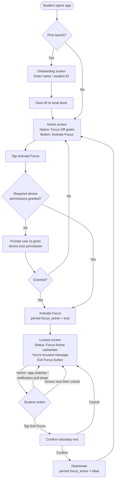
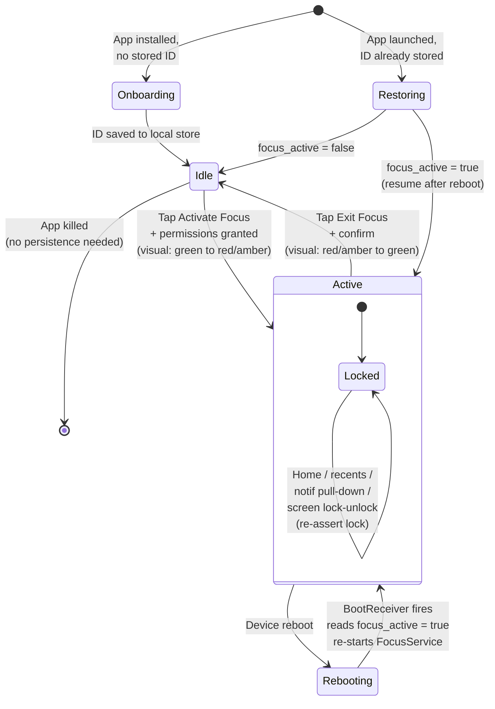
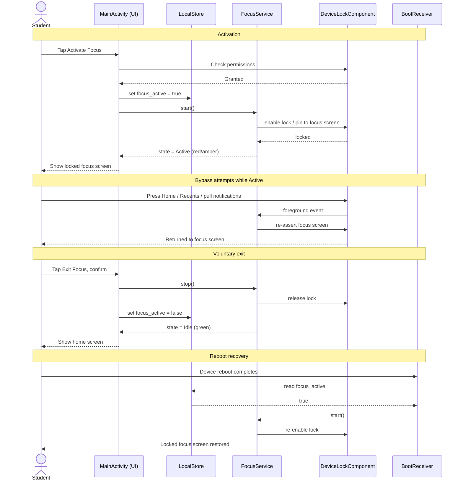
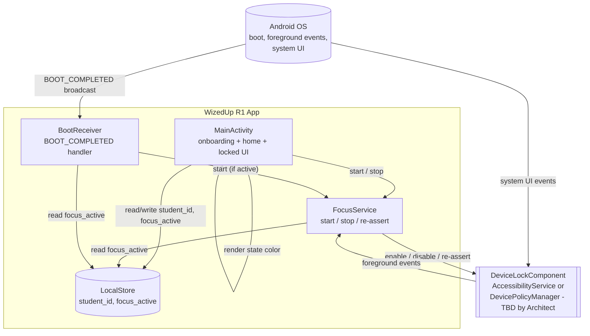

# R1 Android Brick — Workflow Diagrams

Technology-agnostic workflow documentation for Release 1 (Android Brick / Core Focus Mode). The Architect will resolve native-vs-RN and AccessibilityService-vs-DevicePolicyManager separately; these diagrams use generic component names (`FocusService`, `DeviceLockComponent`, `LocalStore`) so they remain valid under either choice.

Scope reminder: voluntary activation, locked single-screen UI blocking other apps, voluntary exit, survives reboot, no backend, no logging, no network.

---

## 1. User Flow

**What it shows:** The end-to-end student journey from first launch (ID entry) through home screen, activation, the locked focus state, and voluntary exit back to home.

---

## 2. State Diagram

**What it shows:** The app's lifecycle states and transitions, including the boot-survival path where a reboot during `Active` re-enters `Active` via the boot receiver instead of dropping back to `Idle`.

---

## 3. Sequence Diagram

**What it shows:** Runtime interactions between the student, MainActivity, FocusService, the device lock component, the local store, and BootReceiver during activation, ongoing blocking, voluntary exit, and reboot recovery.

---

## 4. Component Interaction

**What it shows:** Static wiring between the four R1 components — `MainActivity` (UI), `FocusService` (focus lifecycle), `BootReceiver` (reboot survival), and `LocalStore` (persisted ID + focus flag) — plus their relationship to the generic `DeviceLockComponent` that abstracts whichever Android lock API the Architect picks.

---

## Notes for Reviewers

- All four diagrams treat the locking mechanism as a single abstract `DeviceLockComponent`. Swapping in AccessibilityService vs DevicePolicyManager (or a hybrid) does not change the flows.
- `LocalStore` is shown generically. SharedPreferences, DataStore, or a small SQLite table all satisfy R1.
- Permission flow is shown only at activation time; the Architect may choose to also request at first launch.
- "Re-assert lock" in the sequence diagram covers the survival requirements (home, recents, notification pull-down, screen lock/unlock).
